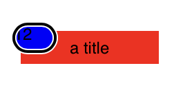
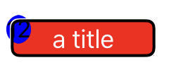
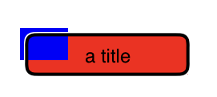

# TextureAccessibility

I'm trying to add accessibility to a button that has a badge representing new notifications. I tried this by adding an `ASTextNode` as subnode to an `ASButtonNode`. When I turn on the screen reader, the badge gets the reader's focus although it reads the title from the button:

When doing the same thing in `UIKit` with a `UIButton` and `UILabel`, the button had focus.

To try to simplify things, I changed the `ASTextNode` to a simple `ASDisplayNode` and saw the same issue:

Here is the weird part: If I do not give the `ASTextNode` or `ASDisplayNode` a `cornerRadius`, then Texture acts just like `UIKit`:

I've followed the code through `CollectAccessibilityElementsForView` and regardless of whether or not `cornerRadius` is set, I get the same inputs and ouputs. I did notice that if I set the badge `layerBacked = YES` then it works regardless of the `cornerRadius`. However, something still seems wrong and I'd like to get a real fix instead of a work around.

